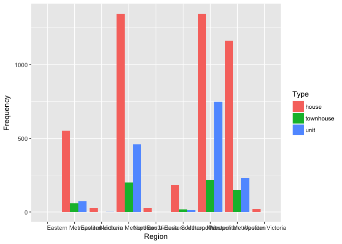
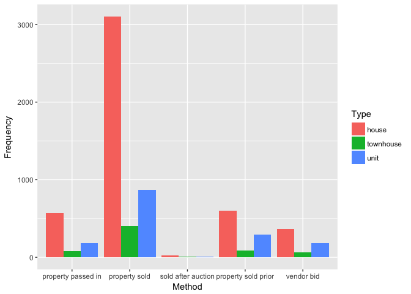
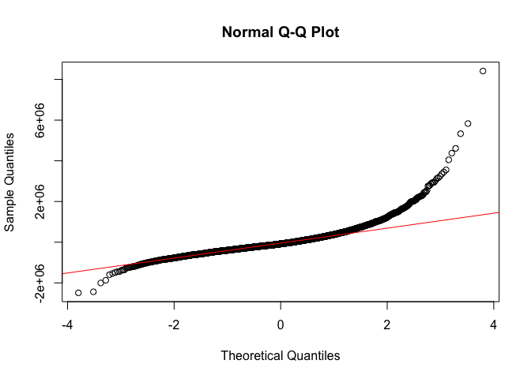

Visualising Melbourne housing data
================

``` r
library(tidyverse)
library(plyr)
library(ggplot2)
library(PerformanceAnalytics)
housing <- read.csv("melb_data.csv")
#overview of the data
glimpse(housing)
```

    ## Observations: 18,396
    ## Variables: 22
    ## $ X             <int> 1, 2, 4, 5, 6, 10, 11, 14, 15, 16, 17, 18, 19, 2...
    ## $ Suburb        <fctr> Abbotsford, Abbotsford, Abbotsford, Abbotsford,...
    ## $ Address       <fctr> 85 Turner St, 25 Bloomburg St, 5 Charles St, 40...
    ## $ Rooms         <int> 2, 2, 3, 3, 4, 2, 3, 2, 3, 2, 1, 2, 2, 2, 1, 2, ...
    ## $ Type          <fctr> h, h, h, h, h, h, h, h, h, t, u, h, u, u, u, u,...
    ## $ Price         <dbl> 1480000, 1035000, 1465000, 850000, 1600000, 9410...
    ## $ Method        <fctr> S, S, SP, PI, VB, S, S, S, S, S, S, S, S, SP, S...
    ## $ SellerG       <fctr> Biggin, Biggin, Biggin, Biggin, Nelson, Jellis,...
    ## $ Date          <fctr> 3/12/2016, 4/02/2016, 4/03/2017, 4/03/2017, 4/0...
    ## $ Distance      <dbl> 2.5, 2.5, 2.5, 2.5, 2.5, 2.5, 2.5, 2.5, 2.5, 2.5...
    ## $ Postcode      <dbl> 3067, 3067, 3067, 3067, 3067, 3067, 3067, 3067, ...
    ## $ Bedroom2      <dbl> 2, 2, 3, 3, 3, 2, 4, 2, NA, NA, 1, 3, NA, NA, NA...
    ## $ Bathroom      <dbl> 1, 1, 2, 2, 1, 1, 2, 1, NA, NA, 1, 1, NA, NA, NA...
    ## $ Car           <dbl> 1, 0, 0, 1, 2, 0, 0, 2, NA, NA, 1, 2, NA, NA, NA...
    ## $ Landsize      <dbl> 202, 156, 134, 94, 120, 181, 245, 256, NA, NA, 0...
    ## $ BuildingArea  <dbl> NA, 79, 150, NA, 142, NA, 210, 107, NA, NA, NA, ...
    ## $ YearBuilt     <dbl> NA, 1900, 1900, NA, 2014, NA, 1910, 1890, NA, NA...
    ## $ CouncilArea   <fctr> Yarra, Yarra, Yarra, Yarra, Yarra, Yarra, Yarra...
    ## $ Lattitude     <dbl> -37.7996, -37.8079, -37.8093, -37.7969, -37.8072...
    ## $ Longtitude    <dbl> 144.9984, 144.9934, 144.9944, 144.9969, 144.9941...
    ## $ Regionname    <fctr> Northern Metropolitan, Northern Metropolitan, N...
    ## $ Propertycount <dbl> 4019, 4019, 4019, 4019, 4019, 4019, 4019, 4019, ...

``` r
#remove missing value
housing <- na.omit(housing) 
```

``` r
#data processing
#see the summary of the data
summary(housing)
```

    ##        X                    Suburb                   Address    
    ##  Min.   :    2   Reservoir     : 170   1/1 Clarendon St  :   3  
    ##  1st Qu.: 5071   Richmond      : 142   36 Aberfeldie St  :   3  
    ##  Median :10344   Brunswick     : 130   1 Bellarine St    :   2  
    ##  Mean   :10753   Bentleigh East: 115   1/108 Truganini Rd:   2  
    ##  3rd Qu.:16454   Coburg        : 110   1/12 Hatfield Ct  :   2  
    ##  Max.   :23545   Essendon      : 105   1/16 Mawbey St    :   2  
    ##                  (Other)       :6058   (Other)           :6816  
    ##      Rooms       Type         Price         Method             SellerG    
    ##  Min.   :1.000   h:4660   Min.   : 131000   PI: 826   Nelson       : 817  
    ##  1st Qu.:2.000   t: 642   1st Qu.: 630000   S :4373   Jellis       : 701  
    ##  Median :3.000   u:1528   Median : 890000   SA:  44   hockingstuart: 582  
    ##  Mean   :2.978            Mean   :1077604   SP: 985   Barry        : 467  
    ##  3rd Qu.:4.000            3rd Qu.:1334000   VB: 602   Ray          : 361  
    ##  Max.   :8.000            Max.   :9000000             Marshall     : 347  
    ##                                                       (Other)      :3555  
    ##          Date         Distance        Postcode       Bedroom2    
    ##  27/05/2017: 225   Min.   : 0.00   Min.   :3000   Min.   :0.000  
    ##  3/06/2017 : 202   1st Qu.: 6.10   1st Qu.:3044   1st Qu.:2.000  
    ##  27/11/2016: 192   Median : 9.20   Median :3083   Median :3.000  
    ##  25/02/2017: 182   Mean   :10.15   Mean   :3104   Mean   :2.951  
    ##  8/07/2017 : 174   3rd Qu.:13.00   3rd Qu.:3147   3rd Qu.:4.000  
    ##  22/07/2017: 171   Max.   :47.40   Max.   :3977   Max.   :9.000  
    ##  (Other)   :5684                                                 
    ##     Bathroom          Car            Landsize        BuildingArea   
    ##  Min.   :1.000   Min.   : 0.000   Min.   :    0.0   Min.   :   0.0  
    ##  1st Qu.:1.000   1st Qu.: 1.000   1st Qu.:  167.0   1st Qu.:  93.0  
    ##  Median :1.000   Median : 2.000   Median :  404.0   Median : 126.0  
    ##  Mean   :1.594   Mean   : 1.607   Mean   :  487.5   Mean   : 143.4  
    ##  3rd Qu.:2.000   3rd Qu.: 2.000   3rd Qu.:  641.0   3rd Qu.: 173.0  
    ##  Max.   :8.000   Max.   :10.000   Max.   :37000.0   Max.   :3112.0  
    ##                                                                     
    ##    YearBuilt           CouncilArea     Lattitude        Longtitude   
    ##  Min.   :1196   Moreland     : 658   Min.   :-38.16   Min.   :144.5  
    ##  1st Qu.:1940                : 634   1st Qu.:-37.86   1st Qu.:144.9  
    ##  Median :1970   Boroondara   : 576   Median :-37.80   Median :145.0  
    ##  Mean   :1964   Moonee Valley: 504   Mean   :-37.81   Mean   :145.0  
    ##  3rd Qu.:2000   Darebin      : 433   3rd Qu.:-37.76   3rd Qu.:145.1  
    ##  Max.   :2018   Glen Eira    : 426   Max.   :-37.41   Max.   :145.5  
    ##                 (Other)      :3599                                   
    ##                       Regionname   Propertycount  
    ##  Southern Metropolitan     :2312   Min.   :  389  
    ##  Northern Metropolitan     :2006   1st Qu.: 4381  
    ##  Western Metropolitan      :1539   Median : 6567  
    ##  Eastern Metropolitan      : 686   Mean   : 7434  
    ##  South-Eastern Metropolitan: 213   3rd Qu.:10175  
    ##  Eastern Victoria          :  28   Max.   :21650  
    ##  (Other)                   :  46

``` r
#recoding variable
housing$Type <- mapvalues(housing$Type, from = c('h', 'u', 't', 'o'), to = c('house','unit','townhouse','other residential'))

#observe the frequency of each suburd
region <- table(housing$Type, housing$Regionname)
region <- as.data.frame(region)
region = rename(region, c("Var1" = "Type", "Var2" = "Region", "Freq" = "Frequency"))
region
```

    ##         Type                     Region Frequency
    ## 1      house                                    0
    ## 2  townhouse                                    0
    ## 3       unit                                    0
    ## 4      house       Eastern Metropolitan       552
    ## 5  townhouse       Eastern Metropolitan        60
    ## 6       unit       Eastern Metropolitan        74
    ## 7      house           Eastern Victoria        27
    ## 8  townhouse           Eastern Victoria         0
    ## 9       unit           Eastern Victoria         1
    ## 10     house      Northern Metropolitan      1345
    ## 11 townhouse      Northern Metropolitan       201
    ## 12      unit      Northern Metropolitan       460
    ## 13     house          Northern Victoria        26
    ## 14 townhouse          Northern Victoria         0
    ## 15      unit          Northern Victoria         0
    ## 16     house South-Eastern Metropolitan       182
    ## 17 townhouse South-Eastern Metropolitan        16
    ## 18      unit South-Eastern Metropolitan        15
    ## 19     house      Southern Metropolitan      1346
    ## 20 townhouse      Southern Metropolitan       218
    ## 21      unit      Southern Metropolitan       748
    ## 22     house       Western Metropolitan      1162
    ## 23 townhouse       Western Metropolitan       147
    ## 24      unit       Western Metropolitan       230
    ## 25     house           Western Victoria        20
    ## 26 townhouse           Western Victoria         0
    ## 27      unit           Western Victoria         0

``` r
#plot region frequency
ggplot(region, aes(x = Region, y = Frequency, fill = Type)) +
  geom_bar(stat = "identity", position = "dodge")
```



``` r
#oberve sold method and type of house
housing$Method <- mapvalues(housing$Method, from = c('S','SP','PI','PN','SN','NB','VB','W','SA','SS','N/A'), to = c('property sold','property sold prior','property passed in','sold prior not disclosed','sold not disclosed','no bid','vendor bid','withdrawn','sold after auction','sold after auction price not disclosed','price or highest bid not available'))

method <- table(housing$Type, housing$Method)
method <- as.data.frame(method)
method = rename(method, c("Var1" = "Type", "Var2" = "Method", "Freq" = "Frequency"))
method
```

    ##         Type              Method Frequency
    ## 1      house  property passed in       566
    ## 2  townhouse  property passed in        79
    ## 3       unit  property passed in       181
    ## 4      house       property sold      3103
    ## 5  townhouse       property sold       405
    ## 6       unit       property sold       865
    ## 7      house  sold after auction        27
    ## 8  townhouse  sold after auction         5
    ## 9       unit  sold after auction        12
    ## 10     house property sold prior       604
    ## 11 townhouse property sold prior        90
    ## 12      unit property sold prior       291
    ## 13     house          vendor bid       360
    ## 14 townhouse          vendor bid        63
    ## 15      unit          vendor bid       179

``` r
#plot
ggplot(method, aes(x = Method, y = Frequency, fill = Type)) +
  geom_bar(stat="identity", position = "dodge")
```



``` r
attach(housing)
names(housing)
```

    ##  [1] "X"             "Suburb"        "Address"       "Rooms"        
    ##  [5] "Type"          "Price"         "Method"        "SellerG"      
    ##  [9] "Date"          "Distance"      "Postcode"      "Bedroom2"     
    ## [13] "Bathroom"      "Car"           "Landsize"      "BuildingArea" 
    ## [17] "YearBuilt"     "CouncilArea"   "Lattitude"     "Longtitude"   
    ## [21] "Regionname"    "Propertycount"

``` r
#select variables that are relevant to real estate price
housing1 <- select(housing,  Rooms, Price, Distance, Bathroom, Car, Landsize)

#cheking correlation
cor(housing1)
```

    ##               Rooms      Price    Distance   Bathroom       Car   Landsize
    ## Rooms    1.00000000  0.5177179  0.28976342 0.61328467 0.4204932 0.09903096
    ## Price    0.51771790  1.0000000 -0.16497466 0.49248086 0.2509159 0.07353590
    ## Distance 0.28976342 -0.1649747  1.00000000 0.12404359 0.2651425 0.08244905
    ## Bathroom 0.61328467  0.4924809  0.12404359 1.00000000 0.3353312 0.08167965
    ## Car      0.42049315  0.2509159  0.26514249 0.33533124 1.0000000 0.11342687
    ## Landsize 0.09903096  0.0735359  0.08244905 0.08167965 0.1134269 1.00000000

``` r
#simple linear regression
model1 <- lm(Price ~ Rooms + Distance + Bathroom + Car + Landsize, data = housing1)
summary(model1)
```

    ## 
    ## Call:
    ## lm(formula = Price ~ Rooms + Distance + Bathroom + Car + Landsize, 
    ##     data = housing1)
    ## 
    ## Residuals:
    ##      Min       1Q   Median       3Q      Max 
    ## -2486756  -290902   -81450   204644  8410836 
    ## 
    ## Coefficients:
    ##               Estimate Std. Error t value Pr(>|t|)    
    ## (Intercept) 111765.983  20995.438   5.323 1.05e-07 ***
    ## Rooms       301894.976   8661.072  34.857  < 2e-16 ***
    ## Distance    -38576.194   1101.890 -35.009  < 2e-16 ***
    ## Bathroom    226792.595  11100.920  20.430  < 2e-16 ***
    ## Car          53318.495   7406.734   7.199 6.73e-13 ***
    ## Landsize        22.627      6.871   3.293 0.000995 ***
    ## ---
    ## Signif. codes:  0 '***' 0.001 '**' 0.01 '*' 0.05 '.' 0.1 ' ' 1
    ## 
    ## Residual standard error: 512300 on 6824 degrees of freedom
    ## Multiple R-squared:  0.4214, Adjusted R-squared:  0.421 
    ## F-statistic: 994.1 on 5 and 6824 DF,  p-value: < 2.2e-16

``` r
#cheking residual
qqnorm(model1$residuals)
qqline(model1$residuals, col = 'red')
```



``` r
#significant test
anova(model1)
```

    ## Analysis of Variance Table
    ## 
    ## Response: Price
    ##             Df     Sum Sq    Mean Sq  F value    Pr(>F)    
    ## Rooms        1 8.2983e+14 8.2983e+14 3161.296 < 2.2e-16 ***
    ## Distance     1 3.3534e+14 3.3534e+14 1277.498 < 2.2e-16 ***
    ## Bathroom     1 1.2219e+14 1.2219e+14  465.486 < 2.2e-16 ***
    ## Car          1 1.4530e+13 1.4530e+13   55.355 1.129e-13 ***
    ## Landsize     1 2.8469e+12 2.8469e+12   10.846 0.0009953 ***
    ## Residuals 6824 1.7913e+15 2.6250e+11                       
    ## ---
    ## Signif. codes:  0 '***' 0.001 '**' 0.01 '*' 0.05 '.' 0.1 ' ' 1
